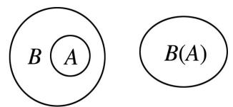
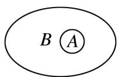

## 2. 子集与真子集

（1）子集的定义:对于两个集合 A, B, 如果集合 A 中任意一个元素都是集合 B 中的元素, 就称集合 A 为集合 B 的子集, 记作 $A \subseteq B$ （或 $B \supseteq A$ ），读作 “A 包含于 B”（或 “B 包含 A”）。如果 A 不是 B 的子集，则记作 $A \not\subseteq B$ （或 $B \not\ni A$ ），读作 “A 不包含于 B”（或 “B 不包含 A”）。

(2)真子集的定义:如果集合 A 是集合 B 的子集,并且 B 中至少有一个元素不属于 A,那么集合 A 称为集合 B 的真子集,记作 $A \subsetneq B$ （或 $B \supsetneq A$ ）,读作 “A 真包含于 B”（或 “B 真包含 A”）.

