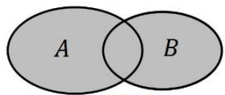

## 1. 并集的概念与运算

(1) 文字语言: 一般地, 给定两个集合 $A, B$ , 由这两个集合的所有元素组成的集合, 称为 $A$ 与 $B$ 的并集, 记作 $A \cup B$ , 读作 “ $A$ 并 $B$ ”.

（2）符号语言： $A\bigcup B = \{x|x\in A\text{或} x\in B\}$

（3）图形语言:阴影部分为 $A \cup B$

（4）并集的常用运算性质

AUB

<table><tr><td>性质</td><td>定义</td></tr><tr><td> $A \cup B = B \cup A$ </td><td>满足交换律</td></tr><tr><td> $A \cup A = A$ </td><td>任何集合与其本身的并集等于这个集合本身</td></tr><tr><td> $A \cup \varnothing = \varnothing \cup A = A$ </td><td>任何集合与空集的并集等于这个集合本身</td></tr><tr><td> $(A \cup B) \cup C = A \cup (B \cup C)$ </td><td>多个集合的并集满足结合律</td></tr><tr><td> $A \subseteq (A \cup B), B \subseteq (A \cup B)$ </td><td>任何集合都是该集合与另一个集合并集的子集</td></tr><tr><td> $A \subseteq B \Leftrightarrow A \cup B = B$ </td><td>任何集合与它子集的并集都是它本身,反之亦然</td></tr></table>
