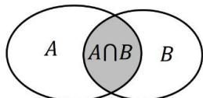

## 2. 交集的概念与运算

(1) 文字语言: 由所有属于集合 $A$ 且属于集合 $B$ 的元素组成的集合, 称为集合 $A$ 与 $B$ 的交集, 记作 $A \cap B$ , 读作 “ $A$ 交 $B$ ”

(2) 符号语言: $A \cap B = \left\{ x \mid x \in A \text{ 且 } x \in B \right\}$

（3）图形语言:阴影部分为 $A\cap B$

（4）交集常用的运算性质

<table><tr><td>性质</td><td>定义</td></tr><tr><td> $A \cap B = B \cap A$ </td><td>满足交换律</td></tr><tr><td> $A \cap \varnothing = \varnothing$ </td><td>空集与任何集合的交集都是空集</td></tr><tr><td> $A \cap A = A$ </td><td>集合与集合本身的交集仍为集合本身</td></tr><tr><td> $(A \cap B) \cap C = A \cap (B \cap C)$ </td><td>多个集合的交集满足结合律</td></tr><tr><td> $(A \cap B) \cup C = (A \cup C) \cap (B \cup C)$ </td><td rowspan="2">多个集合的综合运算满足分配律</td></tr><tr><td> $(A \cup B) \cap C = (A \cap C) \cup (B \cap C)$ </td></tr><tr><td>若  $A \cap B = A$ ,则  $A \subseteq B$ </td><td>交集关系与子集关系的转化</td></tr><tr><td> $(A \cap B) \subseteq A, (A \cap B) \subseteq B$ </td><td>两个集合的交集是其中任一集合的子集</td></tr></table>
