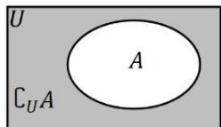

## (2) 补集

定义:如果集合 A 是全集 U 的一个子集, 则由 U 中不属于 A 的所有元素组成的集合, 称为 A 在 U 中的补集, 记作 $C_{U}A$ , 读作 “A 在 U 中的补集”.

符号语言: $C_U A = \{x \mid x \in U \text{ 且 } x \notin A\}$ .

集合的补集也可用维恩图形象地表示,其中全集通常用矩形区

域代表, 如图所示.
