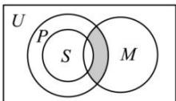

<!-- question-source:start -->
【33】(多选) 如图, $U$ 为全集, $M$ 、 $P$ 、 $S$ 是 $U$ 的三个子集, 则阴影部分所表示的集合是 ( )

A. $\left[P\cap \left(\complement_U S\right)\right]\cap M$ B. $(M\cap P)\cup S$ C. $(M\cap P)\cap \complement_U S$ D. $(M\cap P)\cup \complement_U S$
<!-- question-source:end -->

![[Q00013428A1]]
