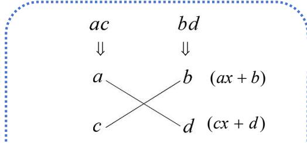

## (2) 十字相乘分解因式

十字相乘法分解二次三项式的步骤：

①把二次项系数和常数项分别拆分成两个数的积；

②尝试选择十字图, 把十字线两端的数相乘后再相加, 使它们的和等于一次项系数;

③根据十字图上下两行的数写出两个因式再相乘.

$$
E x ^ {2} + F x + G = (a x + b) (c x + d)
$$

(其中 E = ac, G = bd, F = ad + bc)

交叉相乘的和为一次项系数 $ad + bc$
