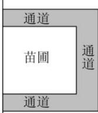

<!-- question-source:start -->
【54】（2022·内蒙古兴安盟·高一乌兰浩特市第四中学校考阶段练习）如图，欲在山林一侧建一矩形苗圃，苗圃左侧为林地，三面通道与苗圃之间由栅栏隔开.

(1) 若苗圃面积为 $1250 \, m^{2}$ ，求栅栏总长的最小值；

（2）若栅栏总长为 $200 \, m$ ，如何设计可使苗圃面积最大？

<!-- question-source:end -->

![[Q00013983A1]]
