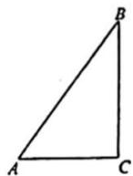

<!-- question-source:start -->
【56】如图（示意），在公路 AB 的一侧有一块空地，在这块空地上规划建造一个口袋公园（如图中 Rt△ABC），其中道路 AC 与 BC 为健身步道，△ABC 内为绿化景观与健身设施等，由于路面材质的不同，AC 段的造价为每米 3 万元，BC 段的造价为每米 2 万元，△ABC 内部的造价为每平方米 2 万元。设 AC 的长为 x 米，BC 的长为 y 米。

（1）若建造健身步道的费用与建造△ABC 内部的费用相等，则如何规划可使公园占地面积（只考虑△ABC 内部）最少？

（2）若建造公园的总费用为 30 万元，则健身步道至少有多长？

<!-- question-source:end -->

![[Q00013985A1]]
