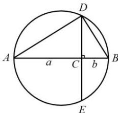

## 3. 基本不等式的推导过程

(1) 几何法:

如图, $AB$ 是圆的直径, 点 $C$ 是 $AB$ 上一点, $AC = a, BC = b$ . 过点 $C$ 作垂直于 $AB$ 的弦 $DE$ , 连接 $AD, BD$ . 可证 $\triangle ACD \sim \triangle DCB$ , 因而 $CD = \sqrt{ab}$ . 由于 $CD$ 小于或等于圆的半径, 用不等式表示为 $\sqrt{ab} \leqslant \frac{a + b}{2}$ . 显然, 当且仅当点 $C$ 与圆心重合, 即 $a = b$ 时, 上述不等式的等号成立.

(2) 代数法:

对于实数 $a, b \in R$ ，有不等式 $(a - b)^{2} \geq 0$ （当且仅当 a = b 时取等号 “=”）恒成立.

即 $a^2 + b^2 - 2ab \geq 0$ ，可得 $a^2 + b^2 \geq 2ab$

特别的, 如果 a > 0, b > 0, 我们用 $\sqrt{a}$ 、 $\sqrt{b}$ 分别代替 a、b, 可得: $\left(\sqrt{a}\right)^{2} + \left(\sqrt{b}\right)^{2} \geq 2\sqrt{a}\sqrt{b}$ 即 $a + b \geq 2\sqrt{ab}$ （当且仅当 a = b 时取等号 “=”）

故可得: 如果 a > 0, b > 0，则 $\frac{a + b}{2} \geq \sqrt{ab}$ （当且仅当 a = b 时取 “=”）
