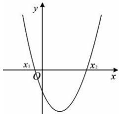
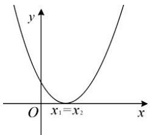
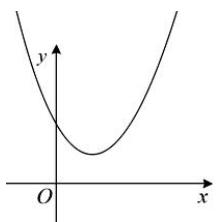

## 3. 二次函数与一元二次方程、不等式的解的对应关系

<table><tr><td colspan="2">判别式 $\Delta = b^{2} - 4ac$ </td><td> $\Delta >0$ </td><td> $\Delta = 0$ </td><td> $\Delta < 0$ </td></tr><tr><td colspan="2">二次函数 $y = ax^{2} + bx + c$  $(a > 0)$ 的图象</td><td></td><td></td><td></td></tr><tr><td colspan="2">方程 $ax^{2} + bx + c = 0$  $(a > 0)$ 的根</td><td>有两个相异实数根 $x_{1,2} = \frac{-b \pm \sqrt{\Delta}}{2a}$ </td><td>有两个相等实数根 $x_{1} = x_{2} = -\frac{b}{2a}$ </td><td>没有实数根</td></tr><tr><td rowspan="2">不等式的解集</td><td> $ax^{2} + bx + c > 0$   $(a > 0)$ </td><td> $\{x | x < x_{1} \text{或} x > x_{2}\}$ </td><td> $\{x | x \neq -\frac{b}{2a}\}$ </td><td> $R$ </td></tr><tr><td> $ax^{2} + bx + c < 0$   $(a > 0)$ </td><td> $\{x | x_{1} < x < x_{2}\}$ </td><td> $\varnothing$ </td><td> $\varnothing$ </td></tr></table>
