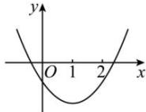

> [!faq]- 全练一本通解析
>
> > [!success]- **【答案】** $m < 0$
>
> > [!note]- **【分析】**
> > 本题未单列分析。
>
> > [!note]- **【解析】**
> > 如下图, 令 $y = x^{2} - 2x + m$ , 即 y < 0 对任意 $1 \leq x \leq 2$ 恒成立,
> > 需满足 $\left\{\begin{aligned}&1-2+m<0\\ &4-4+m<0\end{aligned}\right.$ 解得 m<0，所以 m 的取值范围为 m<0。
> > 
> > $$
> > 0 <   k \leq \frac {2}{5}
> > $$
> > 解析:由题意可知:二次函数 $y=kx^{2}-2x+6k$ 在 2<x<3 内的图象均在 x 轴下方,且 k>0,
> > 则 $\left\{\begin{aligned}&4k-4+6k\leq0\\ &9k-6+6k\leq0\end{aligned}\right.$ ，解得： $0<k\leq\frac{2}{5}$ 所以实数 k 的取值范围是 $0<k\leq\frac{2}{5}$ .
