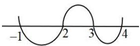
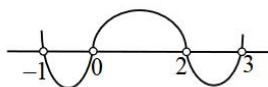
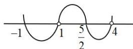
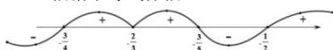
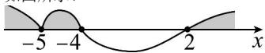
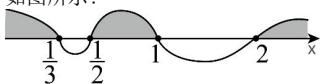
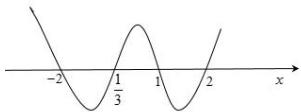

> [!faq]- 全练一本通解析
>
> > [!success]- **【答案】** 详见解析
>
> > [!note]- **【分析】**
> > 本题未单列分析。
>
> > [!note]- **【解析】**
> > （1） $\{x|x\geq4$ 或 $2\leq x\leq3$ 或 $x\leq-1\}$ ;
> > (2) $\left\{x\mid-1<x<0\text{ 或 }2<x<3\right\}$ ;
> > (3) $\left\{x\mid-1\leq x<1\text{ 或 }\frac{5}{2}\leq x<4\right\}$ ;
> > (4) $\{x|x\leq-\frac{3}{4}$ 或 $x=-\frac{2}{3}$ 或 $-\frac{3}{5}\leq x\leq-\frac{1}{2}\}$ ;
> > (5) $\left\{x|x<-5\text{ 或 }-5<x<-4\text{ 或 }x>2\right\}$ ;
> > (6) $\{x|x<\frac{1}{3}\text{ 或 }\frac{1}{2}<x<1\text{ 或 }x>2\}$ ;
> > (7) $\left\{x|x<-2\text{ 或 }\frac{1}{3}<x<1\text{ 或 }x>2\right\}$ ;
> > 解析：（1）对于不等式 $(x + 1)(x - 2)(x - 3)(x - 4)\geq 0$ ，用“穿针引线法”如图示：
> > 
> > 所以原不等式的解集为： $\{x\mid x\geq 4$ 或 $2\leq x\leq 3$ 或 $x\leq -1\}$
> > (2)对于不等式 $x(x-3)(2-x)(x+1)>0$ ，可化为 $x(x-3)(x-2)(x+1)<0$ 用“穿针引线法”如图示：
> > 
> > 所以原不等式的解集为： $\{x\mid -1 <   x <   0$ 或 $2 <   x <   3\}$
> > （3） $2+\frac{2}{x-1}\leq\frac{5}{4-x}$ 可化为： $\frac{(2x-5)(x+1)}{(x-1)(x-4)}\leq0$ ，用“穿针引线法”如图示：
> > 
> > 所以原不等式的解集为： $\{x\mid -1\leq x <   1$ 或 $\frac{5}{2}\leq x <   4\}$
> > 
> > 所以原不等式的解为 $\{x\mid x\leq -\frac{3}{4}$ 或 $x = -\frac{2}{3}$ 或 $-\frac{3}{5}\leq x\leq -\frac{1}{2}\}$
> > （5）原不等式等价于 $(x + 4)(x + 5)^2 (x - 2)^3 >0$
> > 所以 $\left\{\begin{aligned}x&\neq-5\\ (x+4)(x-2)^{3}&>0\end{aligned}\right.$
> > 如图所示:
> > 
> > 解得 x<-4 或 x>2 且 $x \neq -5$ ，
> > 所以原不等式解集为 $\{x\mid x < -5$ 或 $-5 < x < -4$ 或 $x > 2\}$
> > （6）由 $\frac{x^2 - 4x + 1}{3x^2 - 7x + 2} < 1$ 得， $\frac{-2x^2 + 3x - 1}{3x^2 - 7x + 2} < 0$
> > ∴ 原不等式等价于 $\frac{(2x-1)(x-1)}{(3x-1)(x-2)}>0$ ，即 $(2x-1)(x-1)(3x-1)(x-2)>0$ ，
> > 如图所示:
> > 
> > 解得 $x < \frac{1}{3}$ 或 $\frac{1}{2} < x < 1$ 或 x > 2，
> > 所以原不等式的解集为 $\{x \mid x < \frac{1}{3}$ 或 $\frac{1}{2} < x < 1$ 或 x > 2\}.
> > （7）由 $\frac{-3x^2 + 7x - 2}{(x - 1)(x + 2)} < 0$ 可得 $\frac{3x^2 - 7x + 2}{(x - 1)(x + 2)} > 0$ ，即 $\frac{(3x - 1)(x - 2)}{(x - 1)(x + 2)} > 0$
> > 所以 $(3x - 1)(x - 2)(x - 1)(x + 2) > 0$
> > 画数轴采用穿针引线可得:
> > 
> > 原不等式的解集为： $\{x|x < -2$ 或 $\frac{1}{3} < x < 1$ 或 $x > 2\}$
